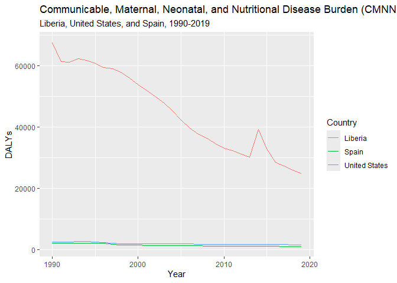

Global Disease Burden Analysis
================
Cassandra Pantuso, Trokon O. Yeabah, Adrián Calvo-Valderrama

# Introduction

This document compares the Disability-Adjusted Life Year (DALY) diseases
burden for three countries: USA, Liberia, and Spain. We compare the
burden due to communicable, maternal, neonatal, and nutritional diseases
(CMNN), non-communicable diseases (NCDs), and overall disease burden for
these countries.

The source data is from the Institute for Health Metrics and Evaluation
(IHME) Global Burden of Disease (GBD) study.

# Communicable, Maternal, Neonatal, and Nutritional Disease Burden (CMNN)

#### Adrián Calvo-Valderrama

## Table of Estimates for CMNN Burden Over Time

| year |  Liberia |    Spain | United States |
|-----:|---------:|---------:|--------------:|
| 1990 | 67486.68 | 2104.942 |      2524.475 |
| 1991 | 61303.07 | 2107.352 |      2546.315 |
| 1992 | 61187.02 | 2155.470 |      2555.518 |
| 1993 | 62306.93 | 2170.322 |      2600.491 |
| 1994 | 61736.94 | 2170.524 |      2625.271 |
| 1995 | 60778.74 | 2190.630 |      2566.224 |
| 1996 | 59300.07 | 2123.365 |      2331.411 |
| 1997 | 59022.15 | 1754.861 |      2073.101 |
| 1998 | 57905.03 | 1564.835 |      1998.776 |
| 1999 | 55850.87 | 1519.691 |      1980.913 |
| 2000 | 53695.71 | 1457.196 |      1932.382 |
| 2001 | 51858.22 | 1411.106 |      1904.670 |
| 2002 | 49959.99 | 1404.245 |      1899.930 |
| 2003 | 47882.62 | 1391.248 |      1890.275 |
| 2004 | 45047.98 | 1353.643 |      1861.106 |
| 2005 | 42169.15 | 1320.599 |      1850.020 |
| 2006 | 39621.25 | 1273.640 |      1824.688 |
| 2007 | 37672.05 | 1258.970 |      1807.625 |
| 2008 | 36312.00 | 1231.068 |      1778.939 |
| 2009 | 34606.77 | 1190.761 |      1740.023 |
| 2010 | 33049.78 | 1164.083 |      1685.302 |
| 2011 | 32287.91 | 1144.067 |      1668.154 |
| 2012 | 31130.16 | 1118.786 |      1653.645 |
| 2013 | 30065.96 | 1076.263 |      1645.378 |
| 2014 | 39214.70 | 1072.376 |      1633.387 |
| 2015 | 32795.78 | 1051.081 |      1631.732 |
| 2016 | 28424.07 | 1047.250 |      1641.419 |
| 2017 | 27279.74 | 1030.264 |      1623.965 |
| 2018 | 26014.29 | 1020.240 |      1605.486 |
| 2019 | 24857.25 | 1011.618 |      1597.437 |

## Plot Showing Trends in CMNN Burden Over Time

<!-- -->

## Plot Showing Cumulative Trends in CMNN Burden Over Time

<!-- -->

## Summary of CMNN Burden Findings

Shown above is the burden of Communicable, Maternal, Neonatal, and
Nutritional Disease Burden (CMNN) for Liberia, Spain and the United
States between 1990 and 2019.The graph above shows that whilst the
United States and Spain display a pretty trend over this time period.
Meanwhile, whilst Liberia’s CMNN Disease Burden numbers are
significantly higher than the other two countries, it shows a strong
decrease over the same period, with a temporary uptick around 2013.

# Non-Communicable Disease Burden (NCD)

#### Cassandra Pantuso

## Table of Estimates for NCD Burden Over Time

| year |  Liberia |    Spain | United States |
|-----:|---------:|---------:|--------------:|
| 1990 | 26558.49 | 20138.59 |      23081.31 |
| 1991 | 26029.00 | 19949.90 |      22833.05 |
| 1992 | 25953.72 | 19613.53 |      22584.36 |
| 1993 | 25830.90 | 19346.22 |      22590.01 |
| 1994 | 25524.15 | 19088.42 |      22473.41 |
| 1995 | 24800.00 | 18927.68 |      22397.64 |
| 1996 | 24835.94 | 18762.35 |      22240.05 |
| 1997 | 24256.96 | 18479.37 |      22133.33 |
| 1998 | 23844.73 | 18352.01 |      22108.63 |
| 1999 | 23267.11 | 18249.17 |      22184.93 |
| 2000 | 22922.44 | 17916.26 |      22163.83 |
| 2001 | 22487.40 | 17671.67 |      22127.69 |
| 2002 | 22247.53 | 17520.61 |      22084.70 |
| 2003 | 22020.65 | 17422.50 |      21947.19 |
| 2004 | 21836.00 | 17155.18 |      21678.45 |
| 2005 | 21808.14 | 16999.33 |      21610.67 |
| 2006 | 21846.25 | 16758.25 |      21472.44 |
| 2007 | 21871.92 | 16638.68 |      21314.34 |
| 2008 | 21960.99 | 16470.32 |      21243.82 |
| 2009 | 22205.32 | 16244.15 |      21138.27 |
| 2010 | 22327.33 | 16042.73 |      20971.39 |
| 2011 | 22326.30 | 15932.35 |      20965.11 |
| 2012 | 22549.44 | 15828.25 |      20930.28 |
| 2013 | 22405.00 | 15650.37 |      20952.17 |
| 2014 | 21970.36 | 15575.66 |      21027.65 |
| 2015 | 21726.71 | 15589.22 |      21166.86 |
| 2016 | 21415.04 | 15476.20 |      21390.44 |
| 2017 | 21091.66 | 15455.88 |      21443.21 |
| 2018 | 20961.84 | 15444.44 |      21569.41 |
| 2019 | 20875.69 | 15453.71 |      21717.37 |

## Plot Showing Trends in NCD Burden Over Time

<!-- -->

## Summary of NCD Burden Findings

Shown above is the burden of non-communicable disease (NCD) in Liberia,
Spain and the United States from 1990 to 2020. Spain is unique, as it
shows a fairly linear downward trend in NCD burden. The burden of
disease in Liberia is also generally trending downward, though there is
a notable spike in the mid 2010’s. From 1990-2010 the downward trend of
NCD burden in the United States has been less dramatic than both Liberia
and Spain. Notably, the United States has been experiencing an increase
in NCD DALYs since the mid 2010’s. While a growing elderly population
and increased prevalence of age-related disease might explain the very
slight leveling of the curve in Spain, it is unlikely that the increase
in NCD burden in the United States can be explained by this alone. It is
plausible that a major contributing factor is widespread issues with
healthcare access, especially preventative and routine care.

# Overall Disease Burden

### Trokon O. Yeabah

## Table of Estimates for Overall Disease Burden Over Time

## Plot Showing Trends in Overall Disease Burden Over Time

## Summary of Overall Disease Burden Findings

Provide a brief analysis based on the data presented in the table and
chart. Highlight any significant findings or patterns. About 3
sentences.
